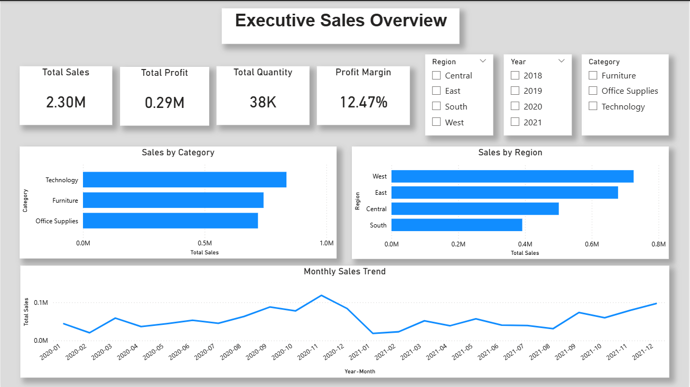
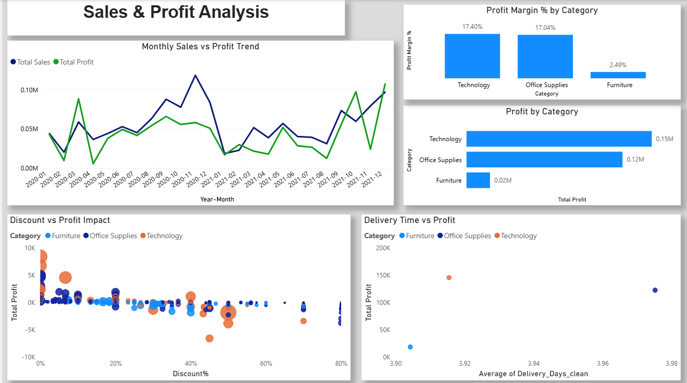

# PowerBI-Sales-Profit-Analysis
Interactive Power BI dashboard analyzing sales, profit, and discount impact using Superstore data
# Sales & Profit Analysis Dashboard (Power BI)

## 📌 Project Overview
This project analyzes sales and profitability using the Superstore dataset.
The dashboard provides an executive overview and detailed sales–profit insights
to support data-driven business decisions.

## 🛠 Tools & Technologies
- Power BI
- Power Query
- DAX
- Excel / CSV

## 📊 Dashboard Features
- Executive KPIs: Total Sales, Total Profit, Profit Margin %, Quantity Sold
- Monthly sales and profit trends
- Category and region-wise performance analysis
- Discount and delivery impact on profitability

 ## 📸 Dashboard Screenshots

### Executive Overview

### Sales & Profit Analysis

## 🧩 Data Modeling
- Star schema with a custom Date dimension
- Fact table: Sales
- Dimension tables: Date, Category, Region, Segment

## 📈 Key Insights
- Technology category generates the highest profit and margins
- Furniture shows lower profitability despite high sales
- Higher discounts negatively impact overall profit
- Faster delivery times are associated with better profitability

## 📁 Files in Repository
- Dataset: Superstore sales data
- Dashboard: Power BI (.pbix) file

## 📬 Author
Sakshi Parit
